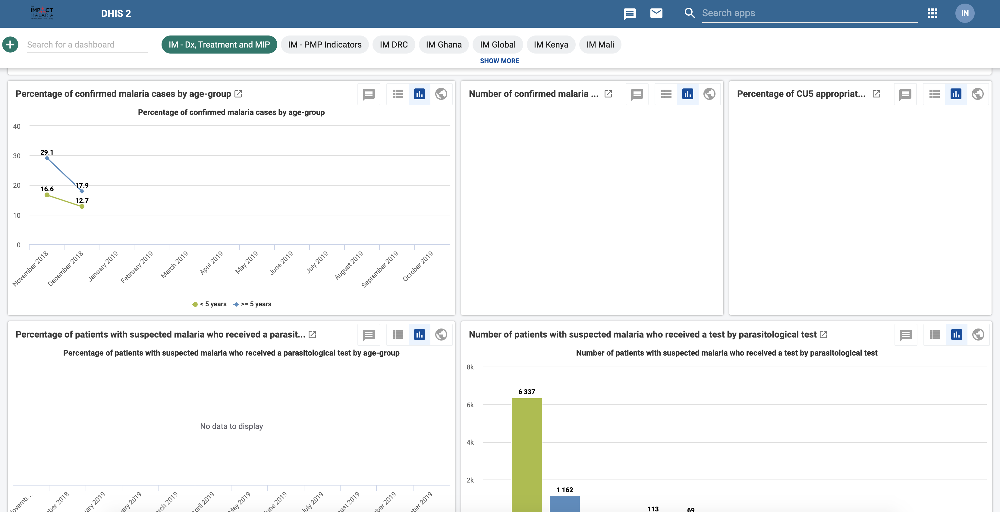

# Introduction {#intro}

## Background

Impact Maria (IM) Data Hub is a web-based project monitoring system used to collect, analyze, and report IM indicator data. IM is a five-year project by the US President’s Malaria Initiative (PMI) global service to reduce malaria mortality and morbidity.

The BAO system implements it in an ST-3 plan that began on Nov 27th, 2018. 

The system hosts all the IM data. Multiple partners use it at different levels from donors (PMI), implementers (PSI, Jhpiego, UCSF,.e.tc), and government ministries of health (MOH) to track project progress and country performance.

It’s active in 11 countries, and collects a tremendous amount of data on; 

1.  Case Management
2.  Malaria in pregnancy 
3.  Seasonal Malaria Chemoprevention
4.  Global Technical Leadership.

IM Data Hub is compatible with HNQIS version 4. 

### Purpose
IM Data Hub was developed;

1. To monitor IM indicator data.
2. Provide access to IM indicator data at the country and global level.
3. Enable central/global level data management 
4. Track project progress and country performance 
5. Promote data use for decision making. 

### Servers
IM Data Hub is available at the following instances; 

1. Development instance: Where all the developments and testing takes place. It’s accessible at https://im-dev.psi-mis.org/ (version 2.30 as of Jan 9, 2019): Analytics run at midnight and 12:00 UTC (EAT -3h)
2. Production instance: Ready for use. Accessible at  impactmalaria-mis.org (Version 2.30, not ready as of Aug 30, 2019):

## Getting Started

The easiest way to get started on IM Data Hub is to log in at the test server at https://im-dev.psi-mis.org/ with the following credentials. 

`Username :`**`demoUser`** `and Password :` **`Temp1234!`**

The landing page!

```{r, echo=FALSE}


```


Countries doing data entry or testings can log in with the following credentials based on their country ISO codes. 


Country |username ; password
--------|:-----------------------------
Congo   |`CDdemo`;`Temp1234!`
Cameroon|`CMdemo`;`Temp1234!`
Ghana | `GHdemo`;`Temp1234!`
Kenya |`KEdemo`;`Temp1234!`
Mali  |`MLdemo`;`Temp1234!`
Niger |`NEdemo`;`Temp1234!`


