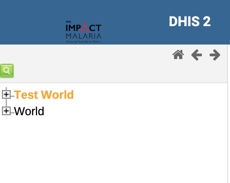
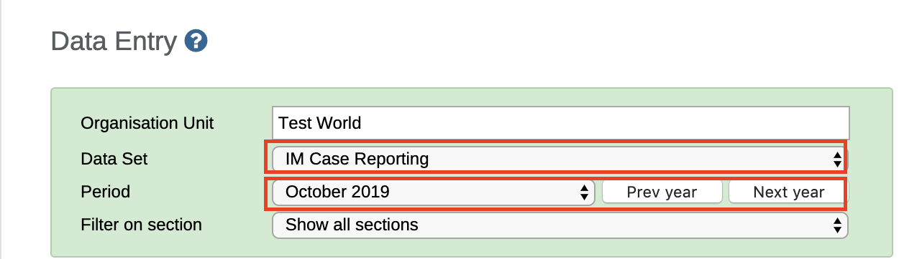
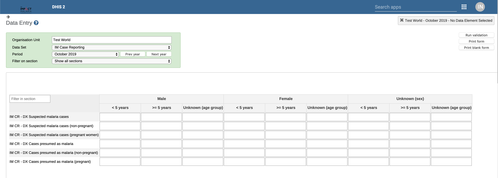
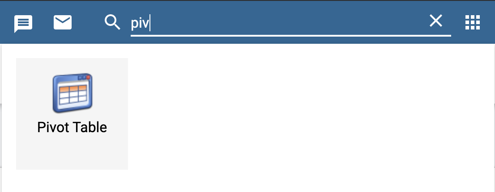
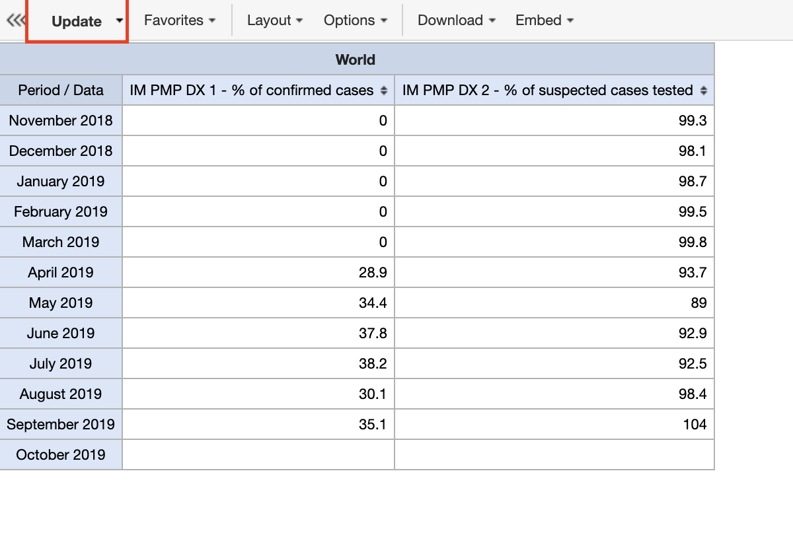
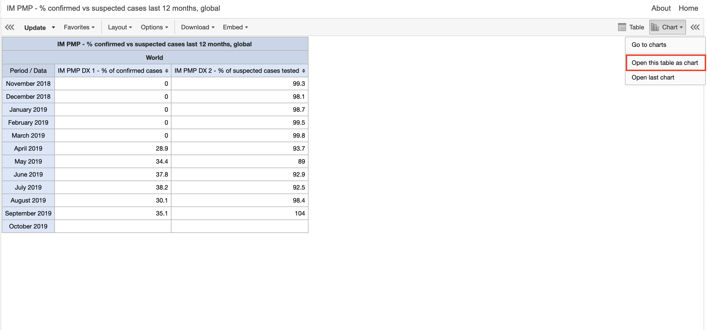
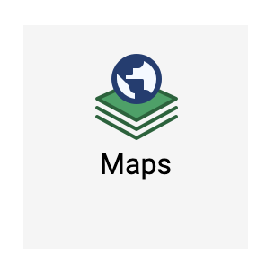
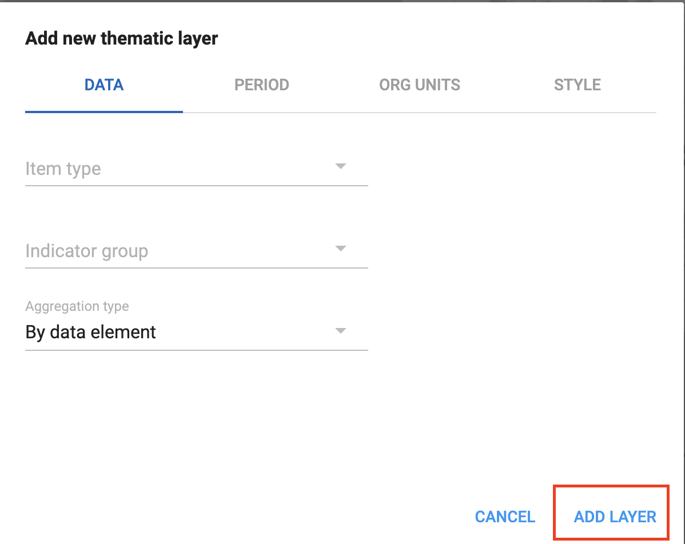

# Understanding IM Data Hub {#comp}

## Introduction

Now that you're already started and you've got some essential background about IM Data Hub, we are going to explore the details/components that form IM Data Hub.
 
As we saw in chapter \@ref(intro), IM Data Hub is not just a database; it's a project monitoring system. It's divided into components; whose primary goal is to monitor IM indicator data for action. 

We'll dive deeper into the components and understand how they are set up in the Hub. 

Understanding IM Data Hub components will allow you to report, analyse, and monitor IM indicators more effectively. 

I'll start by showing you the reporting component, IM Data Hub uses data sets to collect indicator data. We will discuss them briefly in the next section. We will then walk through the data mining piece, and how the different outputs are pulled together on a dashboard for the project use. We'll wind up by exploring the data quality component and how the IM indicator data pass through the quality checks. 


<!-- Reporting Component --->

## Reporting Component

Reporting is organized through the use of data sets. A data set is simply a list of data elements that are grouped for data collection. We’ll talk more about data elements in the next chapter.

A data set has a reporting period and an organization unit. The reporting period specifies how the data is reported, i.e., monthly, or quarterly, while the organization unit determines the location “where” the information is collected. 

IM Data Hub has two main types of data sets; 

1. Global data sets for reporting IM indicators. You will learn more about this in section \@ref(global-dataset)
2. Country specific data set for reporting PMP indicators. You will learn more about this in section \@ref(country-dataset)


The data sets are accessible through the data entry app (Fig. \@ref(fig:data-entry-app)), and they appear as forms. They are designed to mimic the paper forms to allow ease of data entry/reporting process. 

```{r data-entry-app, echo=FALSE, fig.cap="An icon of the data entry app"}
knitr::include_graphics("./images/data-entry-app.png")
```

### Global datasets {#global-dataset}

Global datasets are accessible at a global level and are used to report IM indicators on a monthly and quarterly basis. 

They consist of five data sets, which all begin with the `[project code]` followed by the `[data set name]` as shown below in yellow (Fig \@ref(fig:im-datasets))

```{r im-datasets, echo=FALSE, fig.cap="Global datasets"}

knitr::include_graphics("./images/im datasets.png")
```

Global datasets are divided into sections (in grey) that groups IM data elements into multiple subheadings for ease of data collection.     

There are five main sections: 

1. Diagnosis
2. Treatment
3. MIP
4. Technical leadership
5. Seasonal Malaria Chemoprevention

We will talk about them in chapter \@ref(meta). 


#### Accessing Global Datasets {#access-global-datasets} 
 
1. If you haven’t already logged in yet, please log in now at: 


[IM Data Hub demo](https://im-dev.psi-mis.org/dhis-web-dataentry/index.action)

`Username` :**`demoUser`** and `Password` : **`Temp1234!`**

2. Search for the Data Entry App from Apps
```{r, echo=FALSE}
knitr::include_graphics("./images/data-entry-app2.png")
```


3. Click on the test world on top left if not already selected

```{r, echo=FALSE}

```


4. Select `IM Case Reporting` data set and the period to report; this case October 2019.

```{r, echo=FALSE}

```


5. Wait for the data entry form to load, and check that you can see the same screen as in Fig \@ref(fig:data-entry) below. Congratulations! You can now start reporting.

```{r data-entry, echo=FALSE, fig.cap="IM Case Reporting Data Entry Form"}

```


Before completing the records, please notice the `Run validation` button at the top right. We will talk about this in section 6. 

The complete button submits the records into the data hub.


### Country Specific Datasets {#country-dataset}

Country specific datasets are mainly used to report country’s performance management plan (PMP) indicators. They are accessible at the district or facility level and are reported monthly.

Similar to the global data sets, Country specific ones are organized in sections (in grey) with multiple subheadings. Fig \@ref(fig:pmp-datasets) 

```{r pmp-datasets, echo=FALSE, fig.cap="Country Specific Datasets"}
knitr::include_graphics("./images/pmp datasets.png")
```


#### Accessing Country Specific Datasets

1. Follow the same steps in section \@ref(access-global-datasets) to launch the data entry app. Ensure you are loogied in with your country demo account. 

2. Click on the level to report (i.e country / district / facility) on the left bar

3. Select `[Country ISO] Case Reporting` data set and the period to report; this case October 2019.

4. Wait for the form to load. Congratulations!


For some countries like `Kenya`, `Ghana` and `Mali` the reporting process is automated through scripts. This is discussed in section.


## Data Mining Component

Once the data is collected or loaded into the Data Hub, it then becomes available for data mining. Data mining is a technical process that involves the extraction and analysis of data to generate information.  

The data mining component provides tools for enabling the extraction and analysis of IM indicator data.

1. Pivot Tables - extracts data in a tabular format and enables the ability to pivot IM indicators. 
2. Data Visualizers - generates a variety of charts; standard line, bar charts, pie charts e.t.c
3. Maps - gives the ability to visualize IM data on a map. 


We will discuss more of these tools in section \@ref(pivot), section \@ref(visualizer) and section \@ref(map)

### Pivot Tables {#pivot}

If you are familiar with excel, you are probably aware of “pivoting” the ability to summarize data on table in multiple dimensions. Excel Pivot Tables inspire Pivot Table.  

Pivot Table offers quick access to IM data in a tabular format. It allows the ability to ‘pivot’ data in several dimensions, such as indicators, data elements, periods, and organization units. The aspects can quickly appear as rows or columns, depending on the tailored view.

In the following subsection, we are going to access and tabulate a sample of IM indicator data using the Pivot Table. 

As an example, we tabulate and pivot `IM Confirmed vs. Suspected Malaria Cases.` for last 12 months at the global level (world)


1. Please refresh your browser or login with the demo account below if you have not.

[IM Data Hub demo](https://im-dev.psi-mis.org/dhis-web-dataentry/index.action)

`Username` :**`demoUser`** and `Password` : **`Temp1234!`**

2. From Apps select or search for Pivot Tables


```{r pivot-table, echo=FALSE, fig.cap="Searching Pivot Table App"}

```
3. Click to launch the app. 

4. From the indicator group on your left, select IM PMP indicator and then search % of confirmed case and % of suspected malaria cases

5. Make sure you pull each of the to the  to the right side 
```{r pivot-table2, echo=FALSE, fig.cap="Selecting Indicators in the Pivot Table", fig.width= 100, fig.height=50}
knitr::include_graphics("./images/pivot-table2.png")
```
6. Open the organisation  unit tab and select world

```{r pivot-table4, echo=FALSE, fig.cap="Selecting the organisation unit", fig.width= 100, fig.height=50}
knitr::include_graphics("./images/pivot-table2.png")
```

>At least three dimensions must be specified; What, When and Where in the pivot table

7. Click on the update button to generate the report. Check that you can see a table like mine (fig 8). Congratulations ! We have tabulated our report.

```{r pivot-table3, echo=FALSE, fig.cap="Updating the Pivot Table", fig.width= 100, fig.height=50}

```


> save the table as `IM PMP - % of confirmed vs Suspected cases last 12 months, global` we will refer to them in section 3. 

#### Best practices, tips & tricks

1. Hide empty rows/columns is a very useful Pivot Table option when analysing data across many org units or period with gaps in the data.
2. Sort your table quickly by clicking on the sort symbol inside the column header cells
3. You must always save your table as a favourite before you can add it to your dashboard or share it with colleagues
4. You can add color legends to your table (coloring of cells based on their values) under Options. Multiple legends can now be assigned within the same table and are created in the “Legends” portion of the maintenance app. 


Next we will create a chart of these using the data visualizer app.

### Data Visualizer {#visualizer}

Data Visualizers allows you to generate various charts; bar charts, line graphs, pie charts etc directly in the IM Data  Hub. They follow  the same design and logic as the pivot tables in data selection. 

1. The easiest way to visualize the table in a chart is to open this table as a chart Fig. \@ref(fig:visualizer). 


```{r visualizer, echo=FALSE, fig.cap="Opening this table As a Chart", fig.width= 100, fig.height=50}

```


2. You can as well navigate directly to the data visualizer app by selecting the first option `Go to charts` or launching it form the apps. We will open ours as chart. Check that you see a chart as in (fig  10).

```{r visualizer2, echo=FALSE, fig.cap="A bar chart generated by Data Visualizer App", fig.width= 100, fig.height=50}
knitr::include_graphics("./images/visualizer2.png")
```

By default, `open this table as chart` will attempt to visualize the table in a bar chart. We can switch to this chart to different types by selecting the `type`. Ensure you choose the appropriate type.

We’ll stick to this as it is the most appropriate for this case. It shows the comparison.  


> save your chart as  `IM PMP - % confirmed vs suspected cases last 12 months, global - chart`

In the next section we’ll  explore the maps app. 

### Maps {#map}

The Maps app allows you to set thematic layers of the areas and points, view facilities based on classifications, and visualize catchment areas for the geographical distribution of IM indicator data. 

Example; Malaria Confirmed Cases last 3 months by Region, Ghana.

```{r maps2, echo=FALSE, fig.cap="Malaria Confirmed Cases last 3 months by Region, Ghana", fig.width= 100, fig.height=50}
knitr::include_graphics("./images/maps2.png")
```

To create the map:

1. Navigate to the `Maps` app

```{r map, echo=FALSE, fig.cap="The Maps App", fig.width= 100, fig.height=50}

```

2. Click the icon `Maps` to launch the app
3. Add a `thematic layer`

```{r maps1, echo=FALSE, fig.cap="Select thematic layer", fig.width= 100, fig.height=50}
knitr::include_graphics("./images/maps1.png")
```

4. Follow the steps to select the dimensions; What, when and where.

```{r maps, echo=FALSE, fig.cap="Steps to select the dimensions; What, when and where", fig.width= 100, fig.height=50}

```
5. Update the layer.


#### Best practices, tips & tricks

1. Try not to put many overlapping layers on a map that will be difficult to interpret
2. Use different color schemes when displaying multiple layers on a map
3. The ordering of the layers is 1: Top Most Layer - 4: Bottom Most Layer. Add thematic layers to the map with this in mind.


## Data Presentation 

Once the IM indicators are analyzed, processed, and you've come up with different information products, the next big thing is how this information is used in the routine monitoring of the project. 

Data use is an art by itself. Some several guides and structures attempt to promote data use. At PSI, we use the data use frameworks. - more about data use.

In this section, we cover the data presentation component. This is to show you how the information products are pulled together on a dashboard to:
 
1. Quickly viewing the charts/tables/maps, you use most frequently
2. Monitoring the project progress
3. Establishing a routine for regularly checking key program aspects 
4. Sharing information with others. 


