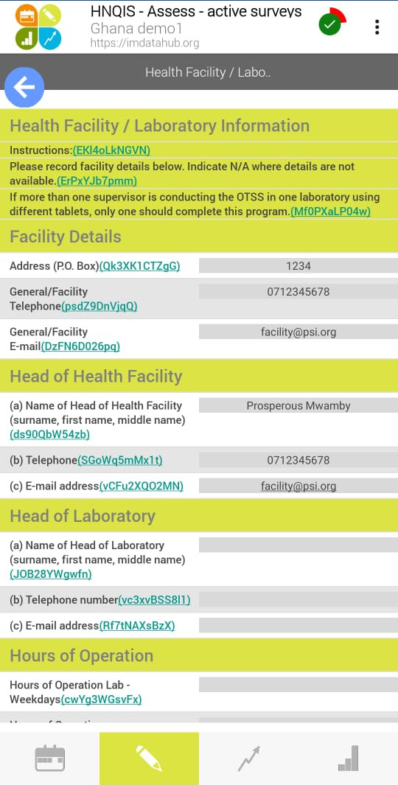
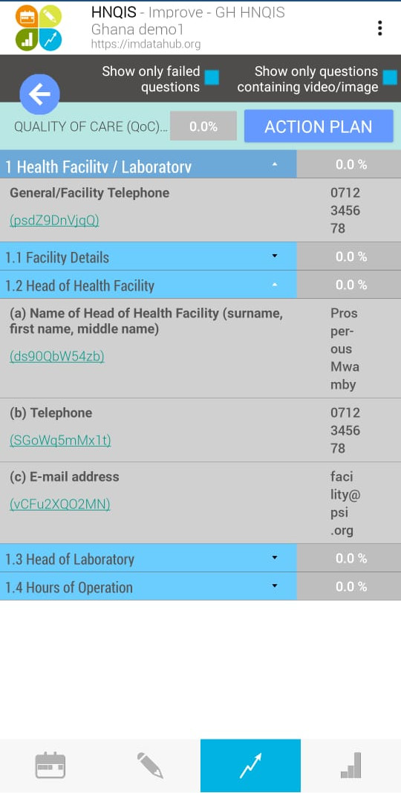

# Health Network Quality Improvement System {#hnqis}

## Introduction

Health Network Quality Improvement System (HNQIS) is an electronic tablet-based application used by health care networks to improve the quality of care and effectively manage and create health impact at scale. 

[We can add a paragraph that explains the foundation, premise, or belief  that forms the HNQIS ]

The HNQIS allows healthcare supervisors to:

1.    Plan supervision visits using a prioritization matrix that presents facility-specific quality scores and patient volume.
2.    Assess providers' quality of care against clinical standards.
3.    Improve providers' quality of care through tailored feedback.
4.    Monitor quality improvements over time.

Providers use HNQIS in measuring their proficiencies in their own skills, and to highlight or identify the critical areas for monitoring and improvement.

HNQIS version 4.1 is linked with IM Data Hub and is fully functional without internet connectivity. 

As of the last count, HNQIS is active in 23 countries and PSI has conducted more than 18,000 assessments at 8,000 outlets across 13 health areas. 

## Modules
HNQIS consists of four modules:

1. **Plan Module** for scheduling assessments based on quality scores. 
2. **Assess Module** for assessing clinical procedures in the target health areas.  
3. **Improve Module** for incorporating providers' feedback.
4. **Monitor Module** for monitoring quality improvement.

### Plan Module

This module automatically schedules future assessments based on where support is needed most (quality score) and where it will have the most impact (client load). It allows supervisors to prioritize support visits by segmenting outlets in the following categories:

1. Never been assessed.
2. Assessments overdue.
3. Scheduled to be assessed in the current month.
4. Scheduled to be assessed in future months.

Each health area consists of an independent planning variable (quality score/client load) that is integrated across all the areas the Quality Assurance Officers are responsible for.

### Assess Module
This module enables QAOs to assess the clinical procedures in target areas catered for by network providers through a case observation or simulation. 

The assessment is done through a checklist that is aligned with the national supervision standards.

After an assessment, scores are generated automatically on-site, and the performance is benchmarked on a standard scale for example; the perforamance can be ranked as `Good /Satisfactory/ Poor`. 

This module contains a consistent approach to scoring and benchmarking all health areas to allow comparability within and across network providers.

### Improve Module
This module ensures that provider feedback following a quality assessment is undertaken robustly and consistently, rather than based on the subjectivity of the QAO. 

Improve Module:

1. Highlights the key areas and the weakness identified during an assessment.
2. Displays tailored feedback scripts that take into account both how the procedure should be undertaken (as per protocols), as well as why it is vital to do so.

It places all the relevant information required to improve the performance of the provider in one place. 

The module facilitates a consistent approach to the provision of feedback, eliminating subjectivity regarding the areas of focus or the actual feedback provided.

### Monitor Module
This module consists of a performance monitoring dashboard tailored to meet the needs of the QAO. The dashboard contains a range of charts, graphs, maps, and tables highlighting trends and overall performance of all the providers the QAO is responsible for supporting. 

Dashboards are used to visualize data collected through other channels that are relevant to quality improvement, such as availability and sales of health commodities. The primary purpose of this module is to facilitate the use of data for decision-making at the QAO level.

Monitor Module offers the QAO an opportunity to track the return on their support visit efforts over time and provide them with insight on where they need to apply a different approach.

## Getting Started

To get started with HNQIS: 

1. Download the app from the Google Play Store by clicking the link below (or by searching **HNQIS**)
    * [HNQIS on Google Play Store](https://play.google.com/store/apps/details?id=org.eyeseetea.malariacare.hnqis_ng)
2. Login into the app using details provided by your country admin.
3. The first page on the screen is the `Plan module` which gives a comprehensive overview of status of facility assessments. 

>The Date of next visit is automatized according to productivity (High/Low) and Quality of Care (QoC) score.

4. The second page is `Assess module` which has customized checklists for assessing the facility and work environment. 

>Y/N answers allow for objectivity while assessing facilities' performance.

5. Next is the `Improve Module` that gives a quick identification of failed questions and critical gaps. 

>The feedback scripts are in line with global guidelines. The standardized feedback reduces District Health Teams subjectivity.

6. Last is the `Monitor Module`, there is a quick overview of District Health Teams performance in terms of assessments and an overview of the QoC scores by health area and by org unit.

To learn more about HNQIS, please visit the IM Data Hub help desk:

* [Getting Started on HNQIS (English)](https://imdatahub.freshdesk.com/en/support/solutions/articles/47001032548-getting-started-on-hnqis)
* [Getting Started on HNQIS (French)](https://imdatahub.freshdesk.com/fr/support/solutions/articles/47001032548-getting-started-on-hnqis)
