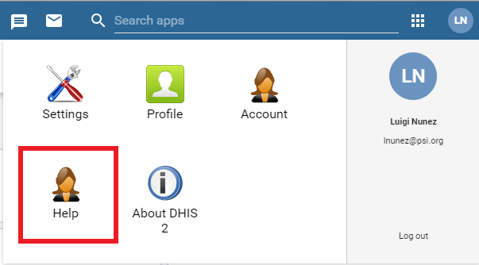
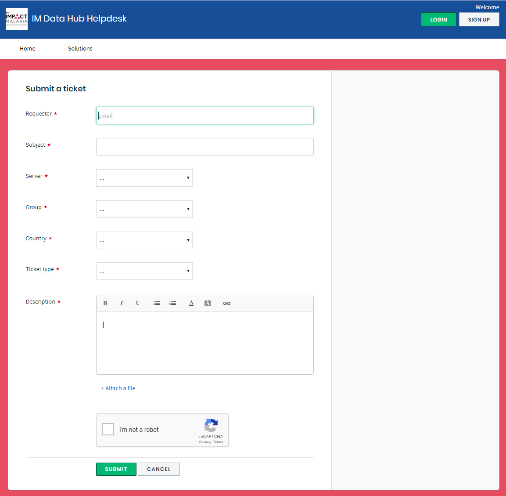

# Getting Help on the IM Data Hub {#trouble}

## IM Data Hub Help Desk

### Introduction
IM Data Hub is linked to a help desk system, IM Data Hub Help Desk, a platform where end users can get information and support on a specific service.

The Help Desk provides information, support and troubleshooting services to the IM Data Hub users. It helps the users and system admins communicate with system administrators more easily.

### Services offered
1.	Submit a ticket for any issue you are experiencing on the IM Data Hub.
2.	View the status of your submitted tickets to track progress on their resolution.  
3.	Learn how to handle tasks through the knowledge base articles from the solutions page.
4.	Request for new features and functionality.
5.	Search for answers for frequently asked questions (FAQs) on the IM Data Hub.
6.	Keep up to date on the IM Data Hub by following announcements via the forum.

### Getting started with IM Data Hub Help Desk
To access the IM Data Hub Help Desk, please click any on the link below:

* English [https://imdatahub.freshdesk.com/en/support/home](https://imdatahub.freshdesk.com/en/support/home)
* French [https://imdatahub.freshdesk.com/fr/support/home](https://imdatahub.freshdesk.com/fr/support/home)

The help desk can also be accessed through the IM Data Hub as outlined below:

1. Click on your initials.

2. Click on the "Help" app.

### Creating a ticket

If you have an issue or a request, please use the steps below to create a ticket

1. Access the help desk by clicking on the link below:
    * [Create a ticket (English)](https://imdatahub.freshdesk.com/en/support/tickets/new)
    * [Create a ticket (French)](https://imdatahub.freshdesk.com/fr/support/tickets/new)
2. Fill in the ticket details as per the form:

* **Requester:** Enter your email address
* **Subject:** Write the subject of your ticket
* **Server:** choose the server on which you are experiencing the issue on
        * dev.imdatahub.org for the development server
        * imdatahub.org for the production server
* **Group:**
    * **Generic** for IM Data Hub issues
    * **HNQIS** for HNQIS specific issues
* **Country:** specify your country or select NA if not applicable
* **Ticket type:** choose **Configuration**, **Maintenance**, **Question**, **Bug** or **Other** depending on the ticket type
* **Description:** Please describe your issue in detail
* **Attach a file:** Please use this to upload relevant files or screenshots to assist in resolving the issue
