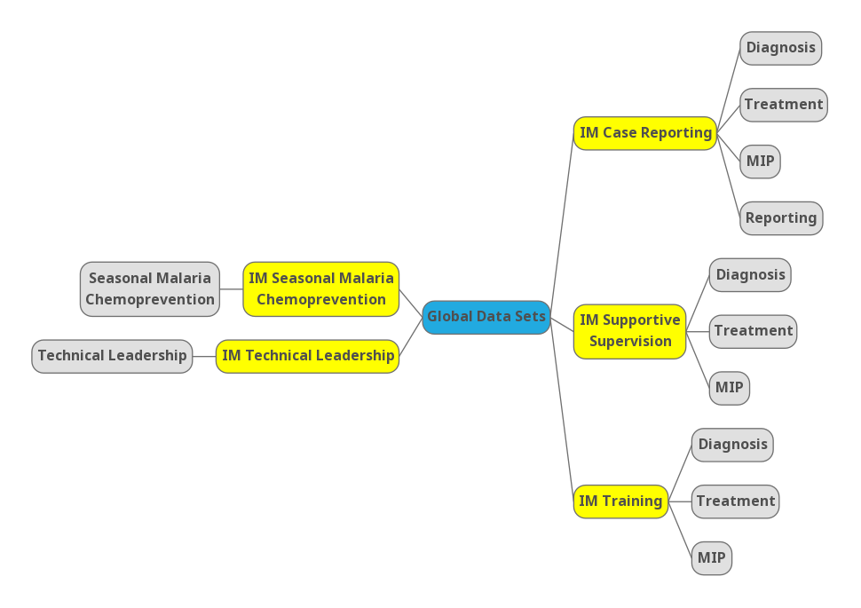

# Understanding IM Data Hub

## Introduction

Now that you're already started and you've got some essential background about IM Data Hub, we are going to explore the details/components that form IM Data Hub.
 
As we saw in the previous chapter, IM Data Hub is not just a database; it's a project monitoring system. It's divided into components; whose primary goal is to monitor IM indicator data for action. 

We'll dive deeper into the components and understand how they are set up in the Hub. 

Understanding IM Data Hub components will allow you to report, analyse, and monitor IM indicators more effectively. 

I'll start by showing the you reporting component, IM Data Hub uses data sets to collect indicator data. We will discuss them briefly in the next section. We will then walk through the data mining piece, and how the different outputs are pulled together on a dashboard for the project use. We'll wind up by exploring the data quality component and how the IM indicator data pass through the quality checks. 

<!-- Reporting Component --->

## Reporting Component

Reporting is organized through the use of data sets. A data set is simply a list of data elements that are grouped for data collection. We’ll talk more about data elements in the next chapter.

A data set has a reporting period and an organization unit. The reporting period specifies how the data is reported, i.e., monthly, or quarterly, while the organization unit determines the location “where” the information is collected. 

IM Data Hub has two main types of data sets; 

1. Global data sets for reporting IM indicators. You will learn more about this in section 2.3
2. Country specific data set for reporting PMP indicators. You will learn more about this in section 2.4


The data sets are accessible through the data entry app, and they appear as forms. They are designed to mimic the paper forms to allow ease of data entry/reporting process. 

```{r, echo=FALSE}
knitr::include_graphics("./images/data-entry-app.png")
```

### Global datasets

Global datasets are accessible at a global level and are used to report IM indicators on a monthly and quarterly basis. 

They consist of five data sets, which all begin with the [project code] followed by the [data set name] as shown below in yellow. (Fig 2)

```{r, echo=FALSE}


```

Global datasets are divided into sections (in grey) that groups IM data elements into multiple subheadings for ease of data collection.     

There are five main sections: 

1. Diagnosis
2. Treatment
3. MIP
4. Technical leadership
5. Seasonal Malaria Chemoprevention

We will talk about them in chapter 4. 


#### Accessing Global Datasets. 
 
1. If you haven’t already logged in yet, please log in now at: 


[IM Data Hub demo](https://im-dev.psi-mis.org/dhis-web-dataentry/index.action)

`Username` :**`demoUser`** and `Password` : **`Temp1234!`**

2. Search for the Data Entry App from Apps
```{r, echo=FALSE}
knitr::include_graphics("./images/data-entry-app2.png")
```


3. Click on the test world on top left if not already selected


4. Select `IM Case Reporting` data set and the period to report; this case October 2019.


5. Wait for the data entry form to load, and check that you can see the same screen as in Fig. 5 below. Congratulations! You can now start reporting.. 


Before completing the records, please notice the `Run validation` button at the top right. We will talk about this in section 6. 

The complete button submits the records into the data hub.


### Country Specific Datasets


