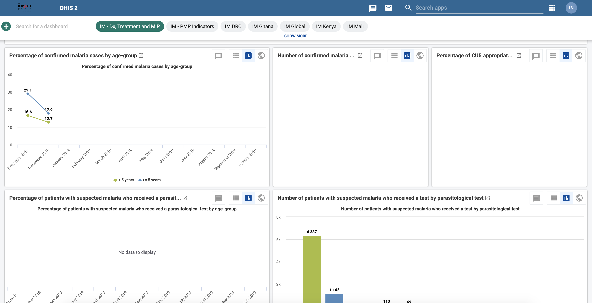
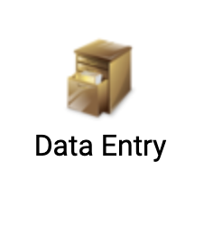
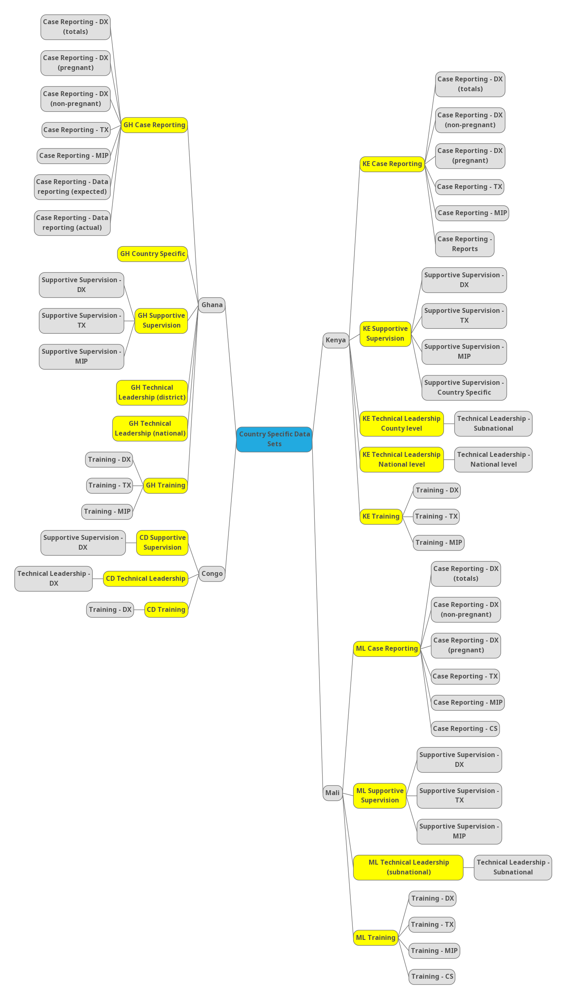

--- 
title: "Impact Malaria Data Hub Specifications"
author: "Isaiah Nyabuto, Cristina Lussiana"
date: "`r Sys.Date()`"
site: bookdown::bookdown_site
output: bookdown::gitbook
documentclass: book
bibliography: [book.bib, packages.bib]
biblio-style: apalike
link-citations: yes
github-repo: INyabuto/im-data-hub
description: "This is a technical specification of the Impact Malaria Data Hub."
always_allow_html: yes
---

# Welcome {-}

```{r echo=FALSE, fig.width=100, fig.height=50}

```

```{r echo=FALSE, fig.width=100, fig.height=50}
knitr::include_graphics("./images/logo2.png")
```

This is a technical guide for the IM Data Hub, __a work currently in progress by BAO systems intended for official release in [production](imdatahub.org) by ______


[__IM Data Hub__](imdatahub.org) is a warehouse for Impact Malaria indicator data. It houses all the IM indicator data for project monitoring and use. It is primarily designed with data users in mind, and so it comes with several tools specifically designed to enable monitoring and promote the use of IM data.

Today, IM Data Hub is extensively used in 11 countries in Africa, and it collects a tremendous amount of data in the following tracks; 


1. case management
2. Malaria in Pregnancy
3. Seasonal Malaria Chemoprevention
4. Global Technical Leadership.

It is used by multiple partners at different levels, from donors (PMI), Implementers (PSI, Jhpiego, UCSF, e.t.c), and government ministries of health in tracking country performance.

IM Data Hub is implemented in an ST-3 plan since Nov 27th, 2018, and it supports HNQIS (1.4) compatibility. 

This guide provides information and the technical specifications you need to know about Impact Malaria (IM) Data Hub. It’s an all-inclusive guide and it complements other materials on the development, testing, or training in the Data Hub.

<!--  Start of the preface -->

# Preface {-} 
## What is IM Data Hub? 
Impact Maria (IM) Data Hub is a project monitoring system used to collect, analyze, and report Impact Malaria indicator data. IM Data Hub is where all the IM data lives.


It's built on DHIS2 core software, and it supports HNQIS (1.4) compatibility. 


## Who should read this guide?

This guide is aimed at two main audiences. 

- System Administrators who are involved in the administration or the daily operation of IM Data Hub.
- Project teams & M&E staff interested to learn more about the IM Data Hub. You will find this helpful in understanding the overall system set up and how different components work together in the system.

## What is covered in this guide.

The guide is divided into seven chapters.

1. Introduction - offers some background information, basic setup, and how to get started on IM Data Hub quickly.
2. Understanding IM Data Hub Components - explores the basic set up to provide an understanding of the different components and how they function.
3. Data Specification - `builds on the understanding of IM Data Hub components and talks about the IM indicators and data reporting.
4. Metadata Specifications - dives into the data specification and the system components and talks about what lies at the bottom, the metadata. 
5. Security and Access Model - Explains the security mechanisms and access model.
6. Customization & Troubleshooting - Guides the customization, troubleshooting, and how to get help on IM Data Hub. 
7. Appendix -


## What is not covered in this guide.

The focus of this guide is to walk you through the technical specification of the IM Data Hub. We attempt to showcase some best practices in configuring, testing, troubleshooting, reporting, monitoring, or use of data in the IM Data Hub. However, still, you need other references to master these essential skill sets. 

## Conventions

This guide follows the following document conventions. 


Abbreviation                   |In Full
----------------------------- |:---------------------------
CR                             | Case Reporting
IM                             |Impact Malaria
SS                             |Supportive Supervision
TR                             |Training
TL                             |Technical Leadership
SMC                            |Seasonal Malaria Chemoprophylaxis
DX                             |Diagnosis
TX                             |Treatment
MIP | Malaria In Pregnancy
CS  |Country Specific
RE  |Reporting
PMP |Performance Management Plan

### Data Sets 
Data set: [`country ISO code`] [`program`]: 

Examples;

- GH Supportive Supervision
- CD Case Reporting |Data set: [country ISO code] [Data entry form name]

### Data Elements 

DEs: [`country ISO code`] [`program abbreviation`] - [`section abbreviation`] [`DE Form name`]:

Examples;

- GH CR - DX Cases confirmed 
- CD TL - DX Does this province have national malaria diagnostic supervision tools that adhere to global standards? 


### Indicators 

Indicators: [`country ISO code`] [`PMP`] - [`section abbreviation`] [`Indicator name`]:

Example;

CD PMP - DX Percentage of health workers demonstrating competence in malaria microscopy 

## Acknowledgement


<!--chapter:end:index.Rmd-->

# Introduction {#intro}

## Background

Impact Maria (IM) Data Hub is a web-based project monitoring system used to collect, analyze, and report IM indicator data. IM is a five-year project by the US President’s Malaria Initiative (PMI) global service to reduce malaria mortality and morbidity.

The BAO system implements it in an ST-3 plan that began on Nov 27th, 2018. 

The system hosts all the IM data. Multiple partners use it at different levels from donors (PMI), implementers (PSI, Jhpiego, UCSF,.e.tc), and government ministries of health (MOH) to track project progress and country performance.

It’s active in 11 countries, and collects a tremendous amount of data on; 

1.  Case Management
2.  Malaria in pregnancy 
3.  Seasonal Malaria Chemoprevention
4.  Global Technical Leadership.

IM Data Hub is compatible with HNQIS version 4. 

### Purpose
IM Data Hub was developed;

1. To monitor IM indicator data.
2. Provide access to IM indicator data at the country and global level.
3. Enable central/global level data management 
4. Track project progress and country performance 
5. Promote data use for decision making. 

### Servers
IM Data Hub is available at the following instances; 

1. Development instance: Where all the developments and testing takes place. It’s accessible at https://im-dev.psi-mis.org/ (version 2.30 as of Jan 9, 2019): Analytics run at midnight and 12:00 UTC (EAT -3h)
2. Production instance: Ready for use. Accessible at  impactmalaria-mis.org (Version 2.30, not ready as of Aug 30, 2019):

## Getting Started

The easiest way to get started on IM Data Hub is to log in at the test server at https://im-dev.psi-mis.org/ with the following credentials. 

`Username :`**`demoUser`** `and Password :` **`Temp1234!`**

The landing page!

```{r, echo=FALSE}


```


Countries doing data entry or testings can log in with the following credentials based on their country ISO codes. 


Country |username ; password
--------|:-----------------------------
Congo   |`CDdemo`;`Temp1234!`
Cameroon|`CMdemo`;`Temp1234!`
Ghana | `GHdemo`;`Temp1234!`
Kenya |`KEdemo`;`Temp1234!`
Mali  |`MLdemo`;`Temp1234!`
Niger |`NEdemo`;`Temp1234!`


<!--chapter:end:01-intro.Rmd-->

---
output:
  bookdown::html_book:
    includes:
      in_header: style.css
---

# Understanding IM Data Hub {#comp}

## Introduction

Now that you're already started and you've got some essential background about IM Data Hub, we are going to explore the details/components that form IM Data Hub.
 
As we saw in chapter \@ref(intro), IM Data Hub is not just a database; it's a project monitoring system. It's divided into components; whose primary goal is to monitor IM indicator data for action. 

We'll dive deeper into the components and understand how they are set up in the Hub. 

Understanding IM Data Hub components will allow you to report, analyse, and monitor IM indicators more effectively. 

I'll start by showing the you reporting component, IM Data Hub uses data sets to collect indicator data. We will discuss them briefly in the next section. We will then walk through the data mining piece, and how the different outputs are pulled together on a dashboard for the project use. We'll wind up by exploring the data quality component and how the IM indicator data pass through the quality checks. 


<!-- Reporting Component --->

## Reporting Component

Reporting is organized through the use of data sets. A data set is simply a list of data elements that are grouped for data collection. We’ll talk more about data elements in the next chapter.

A data set has a reporting period and an organization unit. The reporting period specifies how the data is reported, i.e., monthly, or quarterly, while the organization unit determines the location “where” the information is collected. 

IM Data Hub has two main types of data sets; 

1. Global data sets for reporting IM indicators. You will learn more about this in section \@ref(global-dataset)
2. Country specific data set for reporting PMP indicators. You will learn more about this in section \@ref(country-dataset)


The data sets are accessible through the data entry app (Fig. \@ref(fig:data-entry-app)), and they appear as forms. They are designed to mimic the paper forms to allow ease of data entry/reporting process. 

```{r data-entry-app, echo=FALSE, fig.cap="An icon of the data entry app"}

```

### Global datasets {#global-dataset}

Global datasets are accessible at a global level and are used to report IM indicators on a monthly and quarterly basis. 

They consist of five data sets, which all begin with the `[project code]` followed by the `[data set name]` as shown below in yellow (Fig \@ref(fig:im-datasets))

```{r im-datasets, echo=FALSE, fig.cap="Global datasets"}

knitr::include_graphics("./images/im datasets.png")
```

Global datasets are divided into sections (in grey) that groups IM data elements into multiple subheadings for ease of data collection.     

There are five main sections: 

1. Diagnosis
2. Treatment
3. MIP
4. Technical leadership
5. Seasonal Malaria Chemoprevention

We will talk about them in chapter \@ref(meta). 


#### Accessing Global Datasets {#access-global-datasets} 
 
1. If you haven’t already logged in yet, please log in now at: 


[IM Data Hub demo](https://im-dev.psi-mis.org/dhis-web-dataentry/index.action)

`Username` :**`demoUser`** and `Password` : **`Temp1234!`**

2. Search for the Data Entry App from Apps
```{r, echo=FALSE}
knitr::include_graphics("./images/data-entry-app2.png")
```


3. Click on the test world on top left if not already selected

```{r, echo=FALSE}
knitr::include_graphics("./images/test-world.png")
```


4. Select `IM Case Reporting` data set and the period to report; this case October 2019.

```{r, echo=FALSE}
knitr::include_graphics("./images/im-reporting.png")
```


5. Wait for the data entry form to load, and check that you can see the same screen as in Fig \@ref(fig:data-entry) below. Congratulations! You can now start reporting.

```{r data-entry, echo=FALSE, fig.cap="IM Case Reporting Data Entry Form"}
knitr::include_graphics("./images/data-entry.png")
```


Before completing the records, please notice the `Run validation` button at the top right. We will talk about this in section 6. 

The complete button submits the records into the data hub.


### Country Specific Datasets {#country-dataset}

Country specific datasets are mainly used to report country’s performance management plan (PMP) indicators. They are accessible at the district or facility level and are reported monthly.

Similar to the global data sets, Country specific ones are organized in sections (in grey) with multiple subheadings. Fig \@ref(fig:pmp-datasets) 

```{r pmp-datasets, echo=FALSE, fig.cap="Country Specific Datasets"}

```


#### Accessing Country Specific Datasets

1. Follow the same steps in section \@ref(access-global-datasets) to launch the data entry app. Ensure you are loogied in with your country demo account. 

2. Click on the level to report (i.e country / district / facility) on the left bar

3. Select `[Country ISO] Case Reporting` data set and the period to report; this case October 2019.

4. Wait for the form to load. Congratulations!


For some countries like `Kenya`, `Ghana` and `Mali` the reporting process is automated through scripts. This is discussed in section.


## Data Mining Component

Once the data is collected or loaded into the Data Hub, it then becomes available for data mining. Data mining is a technical process that involves the extraction and analysis of data to generate information.  

The data mining component provides tools for enabling the extraction and analysis of IM indicator data.

1. Pivot Tables - extracts data in a tabular format and enables the ability to pivot IM indicators. 
2. Data Visualizers - generates a variety of charts; standard line, bar charts, pie charts e.t.c
3. Maps - gives the ability to visualize IM data on a map. 


We will discuss more of these tools in section \@ref(pivot), section \@ref(visualizer) and section \@ref(map)

### Pivot Tables {#pivot}

If you are familiar with excel, you are probably aware of “pivoting” the ability to summarize data on table in multiple dimensions. Excel Pivot Tables inspire Pivot Table.  

Pivot Table offers quick access to IM data in a tabular format. It allows the ability to ‘pivot’ data in several dimensions, such as indicators, data elements, periods, and organization units. The aspects can quickly appear as rows or columns, depending on the tailored view.

In the following subsection, we are going to access and tabulate a sample of IM indicator data using the Pivot Table. 

As an example, we tabulate and pivot `IM Confirmed vs. Suspected Malaria Cases.` for last 12 months at the global level (world)


Please refresh your browser or login with the demo account below if you have not.

```{block, type = 'FOO'}
[IM Data Hub demo](https://im-dev.psi-mis.org/dhis-web-dataentry/index.action)

`Username` :**`demoUser`** and `Password` : **`Temp1234!`**
```


<!--chapter:end:02-components.Rmd-->

# Impact Malaria Data Specification {#data}
<!-- SET UP -->
```{r setup, include=FALSE}
load("./hub.RData")
# source("/Users/isaiahnyabuto/Documents/Workspace/utils.R")
library(knitr)
library(kableExtra)
library(dplyr)
library(stringr)
#library(plyr)

# 
# baseurl <- "https://im-dev.psi-mis.org/"
# base <- substr(baseurl,9,26)
# usr <- keyringr::get_kc_account(base,type = "internet")
# pwd <- keyringr::decrypt_kc_pw(base, type = "internet")
# 
# loginDHIS2(baseurl,usr,pwd)

pack <- function(x, pattern){
  x <- which(str_detect(x,pattern))
  c(min(x),max(x))
}

```

## Introduction 

IM data is specified through the use indicators. Indicators consist of a numerator, denominator, and a count. The numerator and denominator are data elements, and the count specifies the applied operation. Counts can be a percentage, a number, or a ratio. 

In this chapter, we are going to explore the IM indicators and how they are constructed in the Data Hub. 

We’ll start by a short introduction to data elements and how they form the base/source of the IM indicators. We’ll then explore the different counts and wind up by showing you all the IM indicators. 


## Data Elements

Data elements form the base of IM indicators. As we mentioned in the previous chapter, they define how IM data are collected and stored in the Data Hub. 

IM Data hub consists of:
Global data elements - are shared across a number of countries. 
Country specific data elements - used by specified country data sets. 

IM data elements are grouped by country and programs for easy access from the pivot table, data visualizer and maps app.

The data elements have the following key fields;

1. `uid, name, shortName, and code` for uniquely identifying the data element in the data hub. 
2. `description` to document more information about the data point.
3. `formName` that appears on the data entry form. 
4. `domainType` that specifies the data model - aggregate or tracker.
5. `aggregationType` defines how data is stored in the data hub.

More about data elements can be found at. 

`http://im-dev.psi-mis.org/api/schemas/dataElement.json`

For now please note the `uid,name,shortName and formName` we will discuss these in section \@ref(global-ind) and section \@ref(country-ind).

## Counts

Counts define the operation applied to IM indicators calculations.

There are four main types of operations;

1. `1 - Atomic (number)` - absolute numbers
2. `1 - Ratio` - a fraction of the numerator and denominator
3. `100 - percent` - a ratio multiplied by 100 percent.
4. `1000 - per thousand` - a ratio multiplied by 1000


## Indicators {#ind}

Remember that an indicator has a numerator, a denominator and a count. In this section, you will notice that similar to data elements, indicators also have the uid, short name and code to uniquely identifying them in the hub.

IM Data Hub indicators are grtouped into two; 

Global IM indicators - computes PMP data for global access.
Country Specific (PMP) indicators - computes PMP data for country access.

We present to you a list of all the IM indicators in section \@ref(global-ind)

### Global IM indicators {#global-ind}

```{r, echo=FALSE}

# r <- GET(paste0(baseurl,"api/indicators.json?filter=name:ilike:PMP&paging=false&fields=name,shortName,code,numeratorDescription,numerator,denominatorDescription,denominator,indicatorType[name]"))
# 
# im_ind <- fromJSON(content(r,"text"))$indicators
# 
# im_ind$count <- im_ind$indicatorType$name

# save(im_ind, file = "./hub.RData")
load("./hub.RData")

# im_ind <- im_ind %>%
#   mutate(numerator2 = paste("id", numerator, sep = " : "))  %>%
#   mutate(numerator3 = paste(numeratorDescription, numerator2, sep = "<br/>")) %>%
#   mutate(denominator2 = paste("id", denominator, sep = " : "))  %>%
#   mutate(denominator3 = paste(denominatorDescription, denominator2, sep = "<br/>")) %>%
#   select(code,name,shortName,numerator3,denominator3,count)
# 
# names(im_ind) <- c("code","name","shortName","numerator","denominator","count")

im_ind_global <- im_ind %>%
  filter(startsWith(name, "IM"))

kable(im_ind_global, escape = F) %>%
  kable_styling(full_width = F, fixed_thead = T, font_size = "7") %>%
  # column_spec(1, width = "10em") %>%
  # column_spec(2, width = "30em") %>%
  # column_spec(3, width = "20em") %>%
  # column_spec(4, width = "15em") %>%
  # column_spec(5, width = "15em") %>%
  # column_spec(1, width = "10em") %>%
  pack_rows("MIP indicators", pack(im_ind_global$code, "MIP")[1], pack(im_ind_global$code, "MIP")[2]) %>%
  pack_rows("DX indicators", pack(im_ind_global$code, "DX")[1], pack(im_ind_global$code, "DX")[2]) %>%
  pack_rows("SMC indicators", pack(im_ind_global$code, "SMC")[1], pack(im_ind_global$code, "SMC")[2]) %>%
  pack_rows("TL indicators", pack(im_ind_global$code, "TL")[1], pack(im_ind_global$code, "TL")[2]) %>%
  pack_rows("TX indicators", pack(im_ind_global$code, "TX")[1], pack(im_ind_global$code, "TX")[2])
   # pack_rows("PMP Inndicators", 11, 30)
```


### Country IM indicators {#country-ind}

#### Kenya

```{r, echo=FALSE}
load("./hub.RData")

im_ind_kenya <- im_ind %>%
  filter(startsWith(name,"KE"))

im_ind_kenya %>%
  kable(escape = F) %>%
  kable_styling(fixed_thead = T, font_size = "7") %>%
  pack_rows("MIP indicators", pack(im_ind_kenya$shortName, "MIP")[1], pack(im_ind_kenya$shortName, "MIP")[2])  %>%
  pack_rows("DX indicators", pack(im_ind_kenya$shortName, "DX")[1], pack(im_ind_kenya$shortName, "DX")[2]) %>%
 # pack_rows("SMC indicators", pack(im_ind_kenya$shortName, "SMC")[1], pack(im_ind_kenya$shortName, "SMC")[2]) %>%
  pack_rows("TL indicators", pack(im_ind_kenya$shortName, "TL")[1], pack(im_ind_kenya$shortName, "TL")[2]) %>%
  pack_rows("TX indicators", pack(im_ind_kenya$shortName, "TX")[1], pack(im_ind_kenya$shortName, "TX")[2])

```

#### Ghana

```{r, echo=FALSE}
load("./hub.RData")

im_ind_ghana <- im_ind %>%
  filter(startsWith(name,"GH"))

im_ind_ghana %>%
  kable(escape = F) %>%
  kable_styling(fixed_thead = T, font_size = "7") %>%
  pack_rows("MIP indicators", pack(im_ind_ghana$shortName, "MIP")[1], pack(im_ind_ghana$shortName, "MIP")[2])  %>%
  pack_rows("DX indicators", pack(im_ind_ghana$shortName, "DX")[1], pack(im_ind_ghana$shortName, "DX")[2]) %>%
 # pack_rows("SMC indicators", pack(im_ind_kenya$shortName, "SMC")[1], pack(im_ind_kenya$shortName, "SMC")[2]) %>%
  pack_rows("TL indicators", pack(im_ind_ghana$shortName, "TL")[1], pack(im_ind_ghana$shortName, "TL")[2]) %>%
  pack_rows("TX indicators", pack(im_ind_ghana$shortName, "TX")[1], pack(im_ind_ghana$shortName, "TX")[2])

```

#### Congo

```{r, echo=FALSE}
load("./hub.RData")

im_ind_congo <- im_ind %>%
  filter(startsWith(name,"CD"))

im_ind_congo %>%
  kable(escape = F) %>%
  kable_styling(fixed_thead = T, font_size = "7") %>%
  #pack_rows("MIP indicators", pack(im_ind_kenya$shortName, "MIP")[1], pack(im_ind_kenya$shortName, "MIP")[2])  %>%
  pack_rows("DX indicators", pack(im_ind_congo$shortName, "DX")[1], pack(im_ind_congo$shortName, "DX")[2]) #%>%
 # pack_rows("SMC indicators", pack(im_ind_kenya$shortName, "SMC")[1], pack(im_ind_kenya$shortName, "SMC")[2]) %>%
  #pack_rows("TL indicators", pack(im_ind_kenya$shortName, "TL")[1], pack(im_ind_kenya$shortName, "TL")[2]) %>%
  #pack_rows("TX indicators", pack(im_ind_kenya$shortName, "TX")[1], pack(im_ind_kenya$shortName, "TX")[2])

```

#### Mali

```{r, echo=FALSE}

load("./hub.RData")

im_ind_mali <- im_ind %>%
  filter(startsWith(name,"ML"))

im_ind_mali %>%
  kable(escape = F) %>%
  kable_styling(fixed_thead = T, font_size = "7") %>%
  pack_rows("MIP indicators", pack(im_ind_mali$shortName, "MIP")[1], pack(im_ind_mali$shortName, "MIP")[2])  %>%
  pack_rows("DX indicators", pack(im_ind_mali$shortName, "DX")[1], pack(im_ind_mali$shortName, "DX")[2]) %>%
  pack_rows("SMC indicators", pack(im_ind_mali$shortName, "SMC")[1], pack(im_ind_mali$shortName, "SMC")[2]) %>%
  pack_rows("TL indicators", pack(im_ind_mali$shortName, "TL")[1], pack(im_ind_mali$shortName, "TL")[2]) %>%
  pack_rows("TX indicators", pack(im_ind_mali$shortName, "TX")[1], pack(im_ind_mali$shortName, "TX")[2])

```

<!--chapter:end:03-data-specs.Rmd-->

---
output:
  bookdown::html_book:
    includes:
      in_header: style.css
---

#  Metadata Specification {#meta}

```{r set up, include=FALSE}
load("./hub.RData")
source("/Users/isaiahnyabuto/Documents/Workspace/utils.R")
library(knitr)
library(kableExtra)
library(dplyr)
#library(plyr)


# baseurl <- "https://im-dev.psi-mis.org/"
# base <- substr(baseurl,9,26)
# usr <- keyringr::get_kc_account(base,type = "internet")
# pwd <- keyringr::decrypt_kc_pw(base, type = "internet")
# 
# loginDHIS2(baseurl,usr,pwd)
# 
# ou_group_set <- function(){
#   r <- GET(paste0(baseurl,"api/organisationUnitGroupSets?fields=name,organisationUnitGroups[name]"))
# 
#   set <- fromJSON(content(r,"text"))$organisationUnitGroupSets
# 
#   if (!is.null(set)){
#     # covert df to a string
#     set$organisationUnitGroups <- substring(as.character(set$organisationUnitGroups), regexpr("['\"']",
#                                                                                     as.character(set$organisationUnitGroups))+1)
# 
#     set$organisationUnitGroups <- str_remove_all(set$organisationUnitGroups,"[()\"']")
# 
#     names(set) <- c("OU group set", "OU groups")
#     set
#   }else{
#     ""
#   }
# 
# 
# }

```

## Introduction

In the previous chapter, we learned about the IM & PMP indicators and how they are stored and constructed in the Data Hub. That is essential knowledge for you to start monitoring IM indicator data from the source to how they are presented in the IM Data Hub.

In this chapter, we'll dive deep to the bottom and explore what lies beneath the IM Data Hub, the metadata. Metadata is data about data. 

Let's get started!

First, I'd say anything in the data hub contains metadata. Metadata defines what, why, where, and how parts are set up in the data hub. They provide references to different objects in the data hub.

Already you are familiar with datasets, data elements, or you might have heard of sections in the other chapters. All these are essentially metadata themselves. 

IM Data Hub Metadata are specified in either CSV, JSON or XML formats are available at the metadata API endpoint:

`https://im-dev.psi-mis.org/api/metadata`

Metadata has a name, uid, code that uniquely identifies the object in the hub. It also has a sharing setting that defines the access group. We’ll talk about the access group in the following chapter. 

All IM Data Hub metadata can be accessed individually by specifying their names or ids on the API endpoint. For example, the metadata for a data element with the short name `suspected malaria cases` is accessed at:

```{block, type = 'FOO'}

https://im-dev.psi-mis.org/api/29/dataElements/eHWYhy8vO8q.json
```

In the following sections we discuss IM Data Hub metadata in three main groups; 

1. Organization Unit stores information about the location where IM indicator data is reported, analyzed, or presented. 
2. Metadata that specifies what, why, and how IM Data Hub components are set up. They include; datasets, data elements, sections, data elements groups & group sets, organization unit groups & group sets, indicators, indicator groups, categories, categories, combo, & combinations. e.t.c
3. Core Metadata - any metadata that is shared publicly for re-usability across the data hub.

## Organization Units (OU)

Organization Units specifies the location or where IM indicators are collected, analyzed, or presented on a dashboard. 

There are two main types of OUs in the data hub.

1. Test - a list of OUs for development and testing objects in the data hub. This is where we have been doing our practices. 
2. World - a list of OUs for production or real use in the data hub.

The main master list is accessible [here]("https://docs.google.com/spreadsheets/d/1fgdpfbVcn0ywUekA8AuXsnxYpDWGk2Safblyom0EWGo/edit#gid=40684118") 

They are structured in the form of a tree or through a hierarchy to allow entries, data processing, and drill downs/ups on the dashboard. They also define access levels in the data hub. We’ll discuss access levels in chapter 5.

IM Data Hub OUs are grouped into OU groups and group sets for disaggregation of IM indicators data. We discuss the groups in section \@ref{ougroup}

### OU Trees

As we mentioned above, IM Data Hub OUs are organized in a tree-like structure that provides different levels for reporting, data processing, and presentation of IM data; in this section, we describe the OU structure by country (Fig X).

The structure is in the form hierarchy and begins with the country to subnational level 4.


Country| Subnational level 1| Subnational level 2| Subnational level 3| Subnational level 4 |
-------|:-------------------|:-------------------|:-------------------|:--------------------|
Cameroon| Region |District| Aire de santé| Facility
Cote d’Ivoire| Region| District| Facility| /
DRC| Province| Zone de santé | Aire de santé | Facility
Kenya | County | Sub-county | Ward | Facility
Ghana | Region | District | Sub-district | Facility 
Mali | Region | District | Aire de santé |Facility
Niger | | | | 
Sierra Leone | Province | District | Chiefdom | Facility
Zambia | Province | District | Facility | /

The following is the Metadata endpoint for organization unit levels.
```{block, type = 'FOO'}
https://im-dev.psi-mis.org/api/organisationUnitLevels.json
```

Next we’ll talk about the OU groups and group sets. 

OU groups, OU group sets.

IM Data Hub OUs consists of the following groups and group sets by countries and the type of facility.

```{r, echo=FALSE}
load("./hub.RData")
#ou_groups <- data.frame(`Country (# of units)` = c("CD (<b>114</b>):", "CI (<b>777</b>):", "CM (<b>751</b>):",
#                                                   "KE  (<b>1775</b>):", "GH (<b>7,948</b>):", "ML (<b>410</b>):",
#"SL (<b>303</b>):", "ZM (<b>227</b>)"))

# ou_group <- ou_group_set()
# save(ou_group, file = "./hub.RData")

resave(ou_group,file = "./hub.RData")
kable(ou_group, caption = "A table showing OU groups and group set") %>% kable_styling()


```


## Metadata

IM Data Hub implements the following Metadata types.

```{r, echo=FALSE}

metadata_types <- data.frame(`Metadata` = c("Data elements","Date element groups","Data sets",
                                                 "Sections","Category combos","Periods", "Indicator", "Indicator groups"),
                             `Description` = c("<h3>Description</h3></p>Data elements forms the basis of the IM Data Hub. They define what is recorded in the system.</p></p>IM Data Hub data elements follows PSI DHIS2 standards for names and short names & the IM Indicator matrix for the form names.</p><p>For instance: <em>IM CR - DX Suspected malaria cases</em> is a data element that records suspected malaria cases</p>
",
"<h3>Description</h3><p>Data element groups provides a mechanism for classifying IM Data Hub data elements into a common theme.</p></p>For instance: <em>CD Supportive Supervision</em> groups together all IM supportive supervision data elements. recorded in Congo</p>",
"<h3>Description</h3></p>Data reporting in the IM Data Hub is organized through the use of the use of data sets.</p><p> A data set is a collection of data elements grouped together for data collection.</p><p> For instance: <em>IM Case Reporting</em> is a data set used to report case reporting data globally</p>
",
"<h3>Description</h3><p>Section are used to split the IM Data Hub data sets into small reportable chunks known as modules.</p> <p>They allow for a bit more flexibility when it comes to using the tabular forms in DHIS2 and are quick and simple to design.</p><p> For instance: <em>Diagnosis, Treatment, MIP and Reporting</em> are section within the IM Case Reporting data set</p>",
"<h3>Description</h3><p>Category combos are used to apply IM disaggregation onto the data elements and indicators.They allow multiple categories to be combined into a related set.</p><p> For instance: <em>IM PMP DX 1  - Percentage of confirmed malaria cases (NP)</em> is disaggregated according to the following categories; <em>CORE - Sex | CORE - Parasitological test | CORE - Age-group</em>
",
"<h3>Description</h3><p>IM Data Hub supports DHIS2 standard period types to report and analyze performance over time.</p><p> For instance: <em>201901</em> to report on January of 2019 </p>
",
"<h3>Description</h3><p>Indicators allows the computation of IM data. They consist of a numerator, a denominator and a data element</p><p>",

"<h3>Description</h3><p>Similar to data elements groups, indicator groups - groups together IM indicator to allow easy access from the analytical tools </p><p> For instance: <em>KE PMP</em> is an indicator group with all PMP indicators for Kenya </p>"),

stringsAsFactors = F)

kable(metadata_types, caption = "A table showing metadata types implimented in the IM Data Hub", escape = F) %>% kable_styling()
```


## Core Metadata

The following is a list of all IM data hub core metadata.


<!--chapter:end:04-metadata-specs.Rmd-->

# Security Mechanism & Access Model {#access}

## Introduction 

Security mechanisms are technical tools or techniques used to implement security services. They define how the system is accessed, by whom, and provides an audit record of all the activities that have taken place. 

Access model, on the other hand, defines how objects are accessed or shared in the system.

In this chapter, we discuss the security mechanism and access model applied in the IM Data Hub. 

## Security Mechanism  

There are two main security mechanisms implemented in the IM Data Hub.

1. Authentication: a mechanism that restricts access to only authorized users or clients in the data hub.
2. Audit trail: a mechanism that detects whether there was an attempt, unexpected, or any unauthorized activity has taken place. 


In this section, we discuss the authentication mechanisms and where to find the audit trail. 

### Authentication Mechanisms

IM Data Hub supports two types of authentication:

1. Basic Authentication. A mechanism that allows users to login or send their credentials over an HTTP web server. 
2. OAuth 2. A mechanism that allows third party clients or apps to connect on behalf of a user via reusable tokens. Oauth2 access is based on IM Data Hub user roles. We’ll discuss user roles in section X.


#### Basic Authentication 

Users can login IM Data Hub by specifying their `username` and `password` on the login page. 

Technically, the username is appended with a colon and the password is encoded through `base64encode` and then sent over to the server. 

`base64encode(username:password)`

IM Data Hub also provides two factor authentication mechanisms which allows the users to receive a `2FA code` for confirmation at the time of login.  You can enable the two factor authentication is enabled on the user settings app. You can read more about the 2FA mechanism.

`https://www.google.com/landing/2step/`


#### OAuth 2 Authentication

Third-party apps can connect to IM Data Hub via tokens provided by the OAuth 2 authentication mechanism. IM data Hub does not support the fine-grained OAuth 2 roles, but rather it provides access based on the user roles. 

Setting up OAuth 2 authentication requires access to the 'IM Data Hub Web API`.  You can find the specification about this in the developer's guide. 


## Access Model 

Access Model defines what and how objects are shared or accessed in the IM Data Hub. Objects, in this case, refers to the data, metadata, and all the components in the data hub. 

There are two ways of setting up the access model.

User roles: Setting roles and the access level for the objects in the data hub.
User groups: Defining groups to sharing access to objects in the data hub.


### User roles

User roles defines the level of access to different objects in the data hub. You can set and assign roles to different objects in from the user app.  

The following are the user roles currently set up the data hub: 

Name  | Details
------ |:--------------
_Admin - Country User Management | Administration of new users and user groups
_Admin - Import / Export MetaData |Import and export of metadata and data
_Admin - Org Unit admin advanced | Edit OU levels
_Admin - Org Units (Basic) | Create, edit, and delete OUs
_Admin - User Management advanced | Clone and disable users
_Analytics - Services (all) | Full access to all of DHIS2 analytical tools
_App - Browser cache cleaner | Clear DHIS2 browser cache
_User - Data Entry Aggregated | Data entry for data sets (Data Entry, Data Capture for DHIS2)
_User - Data Entry Tracker | Data entry for programs (Event capture, DHIS2 Android Capture)


<!--chapter:end:05-security-access.Rmd-->

# Customization & Troubleshooting IM Datahub {#custom}

## Introduction 

As IM datahub continues to be rolled out or used actively in multiple countries, data requirements increase, and so does the need to customize and maintain objects in the datahub. 

Customization involves setting up new objects or components, while maintenance, this case refers to the process of taking care of the already existing objects or components in the datahub.

Maintenance requires an assessment of the current set up to detect flaws or breakages. It is for the overall improvement of the system.

In this chapter, we cover the process of adding new objects and troubleshooting or maintaining existing objects in the data hub. We'll also discuss getting help on IM datahub.

## Adding new objects in the datahub.

There are two ways you can add new objects in the data hub. 

1. From the user interface 
2. Using blueprints

<!--chapter:end:06-customization.Rmd-->

