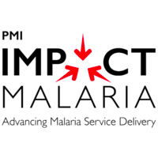

```{r echo=FALSE, fig.width=100, fig.height=50}

```

```{r echo=FALSE, fig.width=100, fig.height=50}

```

--- 
title: "Impact Malaria Data Hub Specifications"
author: "Isaiah Nyabuto, Cristina Lussiana"
date: "`r Sys.Date()`"
site: bookdown::bookdown_site
output: bookdown::gitbook
documentclass: book
bibliography: [book.bib, packages.bib]
biblio-style: apalike
link-citations: yes
github-repo: INyabuto/im-data-hub
description: "This is a technical specification of the Impact Malaria Data Hub."
always_allow_html: yes
---

# Welcome {-}


This is a technical guide for the IMPACT Malaria (IM) Data Hub, developed by Population Services International (PSI), to support IMPACT Malaria technical team to navigate, maintain and use the IM Data Hub.

The [__IMPACT Malaria Data Hub__](imdatahub.org) is the IMPACT Malaria project monitoring system database for IM indicators. It is a web based database in a District Health Information Software 2 (DHIS2) instance and it houses all IM indicator data for project monitoring and use. It is primarily designed with data users in mind, and so its configuration comes with approaches specifically designed to enable monitoring and promote the use of IM data.

The IM Data Hub is used in IM countries in Africa and Asia and it collects a tremendous amount of data in the following tracks:

1. Case management
2. Malaria in Pregnancy
3. Seasonal Malaria Chemoprevention
4. Global Technical Leadership.

It is used by multiple partners at different levels, from Ministries of Health (MoHs), National Malaria Control Programs (NMCPs), donors like the President's Malaria Initiative (PMI), implementers (PSI, Jhpiego, University of California San Francisco (UCSF)) to track project monitoring and performance.

The IM Data Hub has two instances:

- A __development instance__ at [im-dev.psi-mis.org](https://im-dev.psi-mis.org) hosted on a ST-3 plan from BAO Systems since Nov 22nd, 2019 for prototyping, testing and piloting 
- A __production instance__ at [imdatahub.org](https://imdatahub.org) hosted on a ST-3 plan from BAO Systems since Nov 27th, 2018 for actual monitoring and reporting

This guide provides all the information and the technical specifications you need to know about the IM Data Hub. It’s an all-inclusive guide on the IM Data Hub and it complements other materials on DHIS2 configuration, as well as training in the IM Data Hub.

<!--  Start of the preface -->

# Preface {-} 
## What is the IM Data Hub? 
The Impact Maria (IM) Data Hub is a project monitoring system in DHIS2 used to collect, analyze, monitor and report Impact Malaria indicator data. It's built on DHIS2 core software, and it supports HNQIS (1.4.X) compatibility. 


## Who should read this guide?

This guide is aimed at two main audiences:

- System Administrators who are involved in the configuration, maintenance and troubleshooting the IM Data Hub,
- IM Project teams and M&E staff involved in supporting M&E activities like data entry, reporting, data analysis and visualizations and project monitoring.

The audiences will find this guide helpful in understanding the overall system set up and how different components work together in the system.

## What is covered in this guide.

The guide is divided into seven chapters:

1. Introduction - offers some background information, basic setup, and how to get started on the IM Data Hub quickly
2. Understanding IM Data Hub Components - explores the basic set up to provide an understanding of the different components and how they function
3. Data Specification - builds on the understanding of the IM Data Hub components and talks about the IM indicators and data reporting
4. Metadata Specifications - dives into the data specification and the system components and talks about what lies at the bottom, the metadata
5. Security and Access Model - Explains the security mechanisms and access model
6. Customization & Troubleshooting - Guides the customization, troubleshooting, and how to get help on the IM Data Hub
7. Appendix


## What is not covered in this guide.

The focus of this guide is to walk you through the technical specification of the IM Data Hub. We attempt to showcase some best practices in configuring, testing, troubleshooting, reporting, monitoring, or use of data in the IM Data Hub. However, this is not a training on [DHIS2 Foundamentals] (https://academy.dhis2.org/courses/HISP/DHIS2_Level1/2015_Q1/about) and you need other references to master these essential skill sets. 

## Conventions

This guide follows the following abbrevations. 


Abbreviation                   |In Full
----------------------------- |:---------------------------
CR                             |Case Reporting
CS                             |Country Specific
DX                             |Diagnosis
IM                             |Impact Malaria
MIP                            |Malaria In Pregnancy
PMP                            |Performance Management Plan
RE                             |Reporting
SMC                            |Seasonal Malaria Chemoprophylaxis
SS                             |Supportive Supervision
TL                             |Technical Leadership
TR                             |Training
TX                             |Treatment


### Data Sets 
Data set: [`country ISO code`]  [`Data entry form name`]: 

Examples:

- GH Supportive Supervision
- CD Case Reporting

### Data Elements 

DEs: [`country ISO code`]  [`Data entry form name abbreviation`] - [`Section abbreviation`]  [`DE Form name`]:

Examples:

- GH CR - DX Cases confirmed 
- CD TL - DX Does this province have national malaria diagnostic supervision tools that adhere to global standards? 


### Indicators 

Indicators: [`country ISO code`]  [`PMP`]  [`number`] - [`Section abbreviation`]  [`Indicator name`]:

Example:

GH PMP 01 - DX Percentage of confirmed malaria cases 

